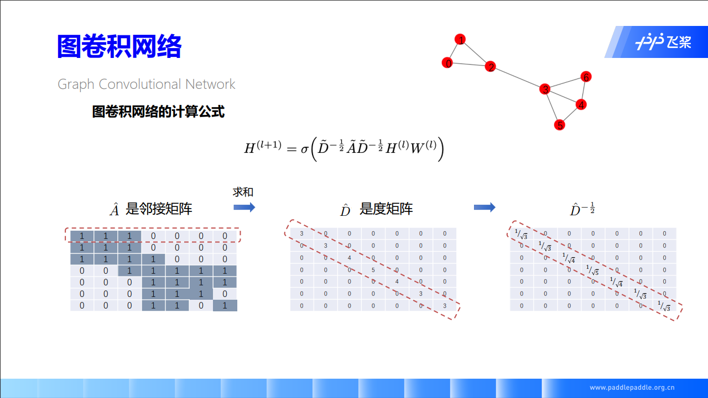

# 再看ST-GCN：图神经网络课程笔记（一）

期待已久的图神经网络课程果然延续了干货满满的风格，课程聚焦于从入门开始娓娓道来，降低了学习的门槛。

这里根据课程对GCN的介绍，对之前学习ST-GCN不甚理解的地方做个回顾。

回顾一下STGCN论文的相关资料。

## STGCN：路网交通预测

### 论文资料

- [Spatio-Temporal Graph Convolutional Networks: A Deep Learning Framework for Traffic](https://arxiv.org/abs/1709.04875v4)
- [原文代码](https://github.com/VeritasYin/STGCN_IJCAI-18)

### 参考资料

- [论文阅读笔记](https://davidham3.github.io/blog/2018/05/10/spatio-temporal-graph-convolutional-networks-a-deep-learning-framework-for-traffic/)
- [mxnet复现代码](https://github.com/Davidham3/STGCN)
- [STGCN论文详解

## 路网图结构

诚如论文中所说，城市中道路网络具有着天然的网结构数据，节点就是车流量观测点（如高速摄像头记录的车速），边就是联通的道路；又或者节点是车流量观测点记录的通过车速，边就是一段时间内观测点记录的车流量。

回顾一下课程中的介绍，可以看出，交通路网是典型的不规则数据。而在STGCN中，将GCN用来提取空间信息。

GCN作为用来处理图结构的卷积，需要将一个节点周围的邻居按照不同的权重叠加起来。论文中花了一些篇幅介绍谱分解的理论，不过最后得出的公式和课程是一样的。

图卷积可以表示为：

![[公式]](https://www.zhihu.com/equation?tex=%5CTheta+%2A_g+x+%3D+%5Ctheta%28I_n+%2B+D%5E%7B-%5Cfrac%7B1%7D%7B2%7D%7DWD%5E%7B-%5Cfrac%7B1%7D%7B2%7D%7D%29x+%3D+%5Ctheta%28I_n+%2B+%5Ctilde%7BD%7D%5E%7B-%5Cfrac%7B1%7D%7B2%7D%7DW+%5Ctilde%7BD%7D%5E%7B-%5Cfrac%7B1%7D%7B2%7D%7D%29x++%5Ctag+5+++)

纵向堆叠一阶近似的图卷积可以获得和横向的K阶卷积相同的效果，所有的卷积可以从一个顶点的K−1阶近邻中获取信息。K是连续卷积运算的次数或是模型中的卷积层数。另外，针对层的线性结构是节省参数的，并且对大型的图来说效率很高，因为多项式近似的的阶数为1。

## GCN的泛化

和简单GCN不同的是，交通路网的图结构还需要考虑时间维度的信息，因此需要对GCN进行泛化。

定义于n维向量![[公式]](https://www.zhihu.com/equation?tex=x+%5Cin+R%5En)上的图卷积运算∗g也可以应用到多维张量上。对于一个有着Ci个通道的信号![[公式]](https://www.zhihu.com/equation?tex=X%5Cin+R%5E%7Bn%5Ctimes+C_i%7D)，图卷积操作可以扩展为:

![[公式]](https://www.zhihu.com/equation?tex=y_j+%3D+%5Csum_%7Bi%3D1%7D%5E%7BC_i%7D%5CTheta_%7Bi%2Cj%7D%28L%29x_i+%5Cin+R%5E%7Bn%7D%2C+1%5Cleq+j%5Cleq+C_0++%5Ctag6+++)

其中，切比雪夫系数![[公式]](https://www.zhihu.com/equation?tex=%5Ctheta_%7Bi%2Cj%7D+%5Cin+R%5EK+)有![[公式]](https://www.zhihu.com/equation?tex=C_i%5Ctimes+C_o)个向量（![[公式]](https://www.zhihu.com/equation?tex=C_i%EF%BC%8CC_o) 分别是输入和输出特征值的大小）。针对二维变量的图卷积表示为![[公式]](https://www.zhihu.com/equation?tex=%5CTheta%E2%88%97_gX)，其中![[公式]](https://www.zhihu.com/equation?tex=%5CTheta+%5Cin+R%5E%7BK%C3%97C_i%C3%97C_o%7D)。需要注意的是，输入的交通预测是由M帧路网组成的。每帧![[公式]](https://www.zhihu.com/equation?tex=v_t)可以被视为一个矩阵，它的第i列是图![[公式]](https://www.zhihu.com/equation?tex=g_t)中第i个顶点的一个为![[公式]](https://www.zhihu.com/equation?tex=C_i)维的值，也就是![[公式]](https://www.zhihu.com/equation?tex=X+%5Cin+R%5E%7Bn%C3%97C_i%7D)（本例中，![[公式]](https://www.zhihu.com/equation?tex=C_i%3D1)）。对于M中的每个时间步t，相同的核与相同的图卷积在![[公式]](https://www.zhihu.com/equation?tex=X_t%5Cin+R%5E%7Bn%C3%97C_i%7D)中并行运算。因此，图卷积操作也可以泛化至三维，记为![[公式]](https://www.zhihu.com/equation?tex=%5CTheta%E2%88%97_g+x)，其中![[公式]](https://www.zhihu.com/equation?tex=+x%5Cin+R%5E%7BM%C3%97n%C3%97C_i%7D)。

## 交通图网的物理意义

是不是可以这样认为，在交通图上上做GCN的泛化后，对路网的监测站节点而言，就将这个节点在空间上的邻居节点消息和时间上的邻居节点消息都传递到了当前节点，和人们对路网交通理解保持一致：当前能开到多快的车速，即受到改节点前N时刻的车速影响，也受到改节点附近道路通行情况影响?

